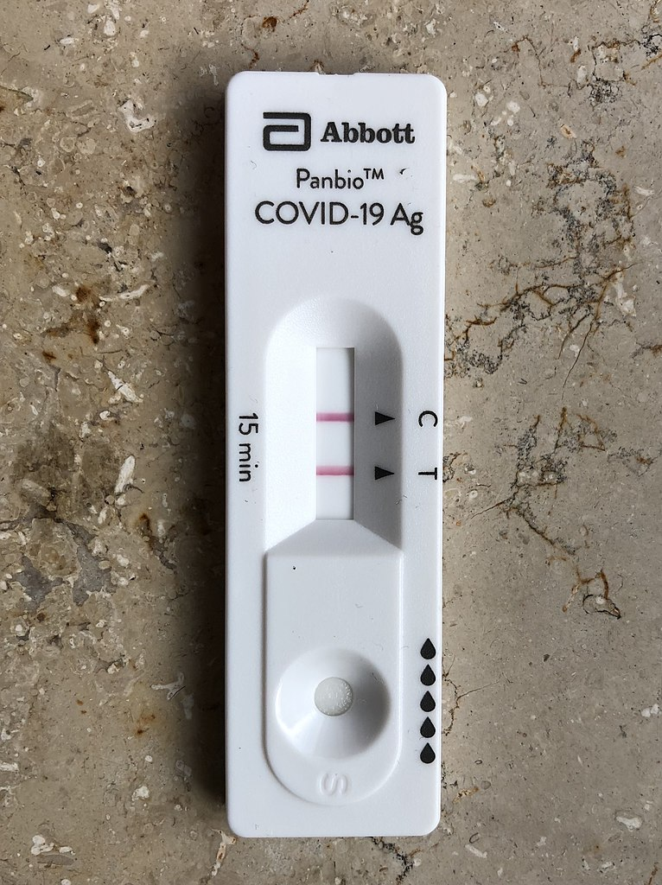
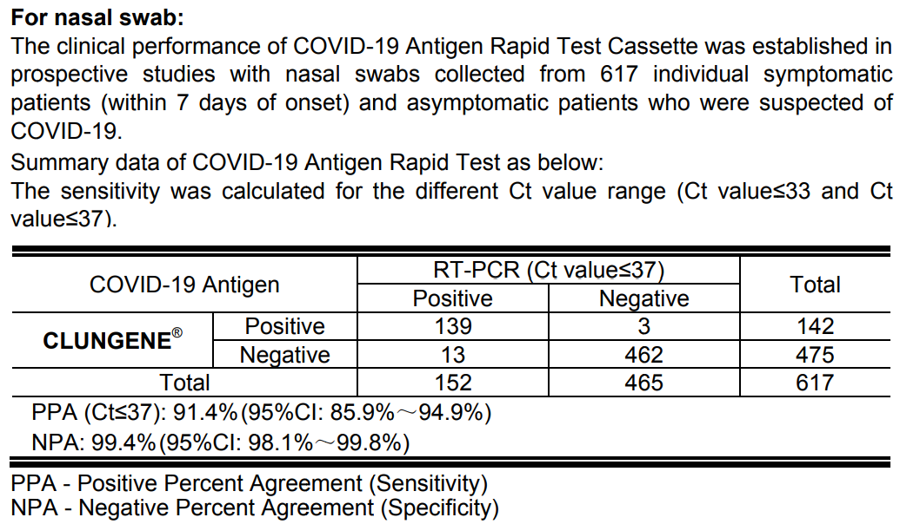
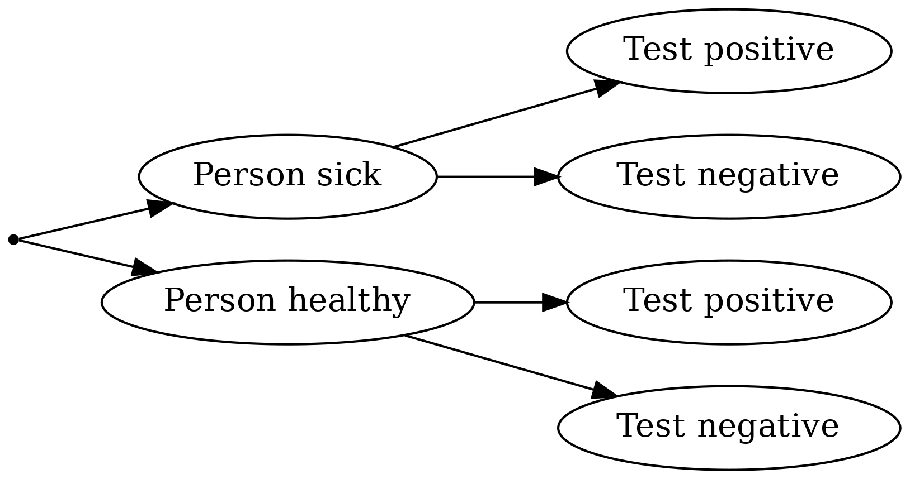
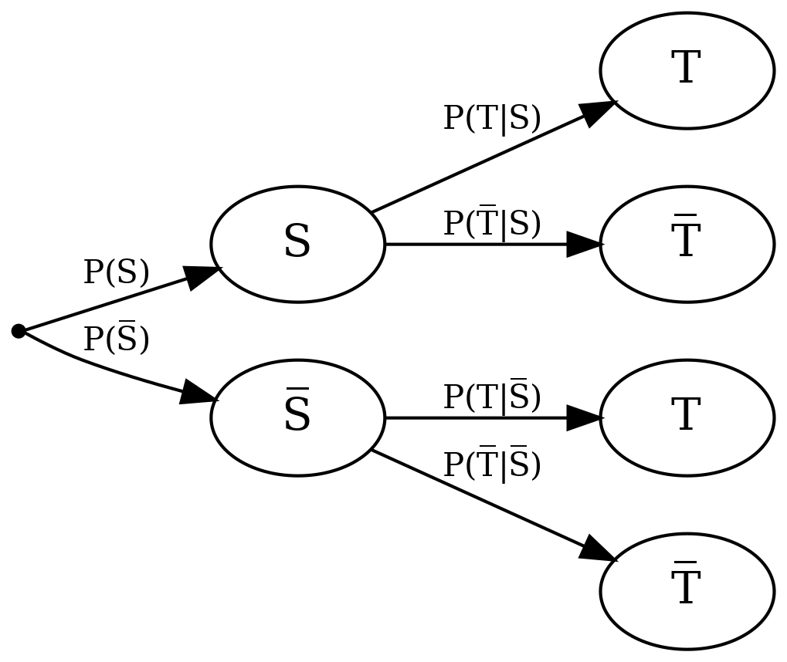
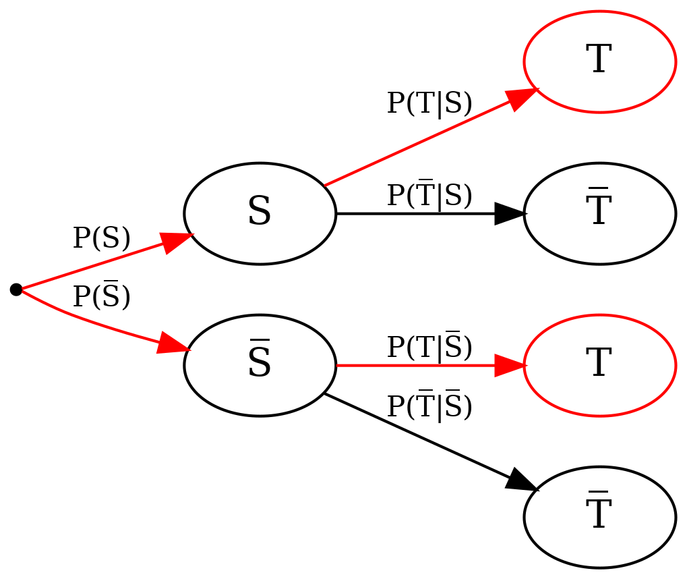
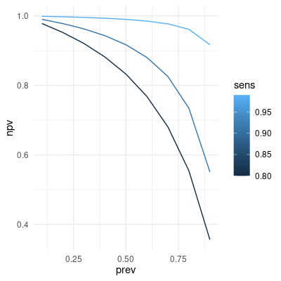

```{r setup, include=FALSE}
require(RAppArmor) 
library(learnr)
library(gradethis)
library(shiny)
library(ggplot2)

rmarkdown::find_pandoc(cache = FALSE)
knitr::opts_chunk$set(echo = FALSE)

gradethis_setup()

# values for the examples
prevalence <- 0.2 / 100.0   # P(S)
sens <- 0.914   # P(T|S)
spec <- 0.994   # P(~T|~S)
pos_pred_val <- sens * prevalence / (sens * prevalence + (1-spec) * (1-prevalence))   # P(S|T)
```

## The problem

A person is feeling sick and decides to take a rapid Covid test. Unfortunately, the test comes back positive.

{height="300px"}

The test is positive, but how certain can the person be that they are truly infected with Covid, i.e., how certain can they be that the test result is accurate? The same question could be asked if the test were negative: How certain is it in this case that the person is truly *not* infected with Covid?

::: summary
#### The problem

What is the probability that a person with a positive Covid test is truly infected? What is the probability that a person with a negative Covid test is truly healthy?
:::

First, we take a look at the package insert of the rapid test in the hope of finding answers to our questions.

{height="350px"}

::: summary
#### Confusion matrix of the rapid test

|               | **Person sick** | **Person healthy** | Total |
|--------------:|:---------------:|:------------------:|:-----:|
| Test positive |       139       |         3          |  142  |
| Test negative |       13        |        462         |  475  |
|         Total |       152       |        465         |  617  |
:::

Let's try to decipher the information. Apparently, a study was conducted in which samples were taken from individuals. These samples were subjected to an RT-PCR test and a rapid test of the CLUNGENE brand via nasal swab, and the results of both tests were compared for each person.

```{r clinicalstudy1}
question_numeric("How many people participated in the study?",
  answer(617, correct = TRUE),
  allow_retry = TRUE
)
```

In this study, we are only interested in the accuracy of the rapid test. To do this, we assume that the result of the RT-PCR test is exact and that we know whether a person is infected with Covid or not. We then check whether the rapid test correctly identifies the health status of the individuals or not. From here on, we will refer to the Covid rapid test simply as *test*.

When we evaluate the result of such a test, we can first determine that we are dealing with four possible outcomes:

-   The person is sick and the test is positive.
-   The person is sick and the test is negative.
-   The person is healthy and the test is positive.
-   The person is healthy and the test is negative.

This can be presented as a table:

|               | **Person sick** | **Person healthy** |
|--------------:|:---------------:|:------------------:|
| Test positive |  true positive  |   false positive   |
| Test negative | false negative  |   true negative    |

This table representation is called a *confusion matrix*.

```{r clinicalstudy2}
question_numeric("For how many persons in the study did the test provide a correct answer?",
  answer(601, correct = TRUE),
  allow_retry = TRUE
)
```

Below the confusion matrix in the package insert, we find two percentage values: *PPA* and *NPA*. These were calculated from the values in the table and are quality measures for medical tests:

**PPA** stands for *positive percent agreement* or *true positive rate*, or *sensitivity*. The value indicates how many percent of confirmed positive Covid cases are correctly identified as positive by the test. In our test, it is on average 91.4%.

**NPA** stands for *negative percent agreement* or *true negative rate*, or *specificity*. The value indicates how many percent of confirmed negative Covid cases are correctly identified as negative by the test. In our test, it is on average 99.4%.

```{r calc_sens}
question_text("How was the true positive rate, or sensitivity of 91.4% calculated from the confusion matrix in the package insert?",
  answer_fn(function (input) {
      mark_as(gsub("\\s+", "", input) == "139/152*100")
  }),
  allow_retry = TRUE,
  trim = TRUE,
  placeholder = 'Enter a percentage calculation in the form "a/b*100".'
)
```

```{r calc_spec}
question_text("How is the true negative rate, or specificity of 99.4% calculated from the confusion matrix in the package insert?",
  answer_fn(function (input) {
      mark_as(gsub("\\s+", "", input) == "462/465*100")
  }),
  allow_retry = TRUE,
  trim = TRUE,
  placeholder = 'Enter a percentage calculation in the form "a/b*100".'
)
```

```{r confmat}
question("Let's assume a computer system can recognize whether a bone is damaged based on an X-ray image. It can recognize three different states: No damage, bruise, bone fracture. Can a confusion matrix also be created for such a system? If so, how many rows and columns would this matrix have?",
  answer("2 rows and 2 colums"),
  answer("2 rows and 3 colums"),
  answer("3 rows and 2 colums"),
  answer("3 rows and 3 colums", correct = TRUE),
  answer("It is not possible to create a confusion matrix for such a computer system."),
  allow_retry = TRUE
)
```

Why do test accuracy, sensitivity, and specificity not answer our actual question, which we see in the summary at the top right? We will look at this on the following page.

## Analysis

To formalize the problem, we represent the procedure in the study as a tree diagram, which will later help us answer the actual question. We know who is healthy and who is sick and check for each group of people how the test turns out:

{height="200px"}

We will first define two events and their negation to help us do the number work. They correspond to the possibilities mentioned above.

-   $S$: Person sick,
-   $\overline S$: person healthy,
-   $T$: test positive,
-   $\overline T$: test negative.

::: summary
#### Definition of the events

-   $S$: Person sick and $\overline S$: person healthy,
-   $T$: test positive and $\overline T$: test negative.
:::

We can transfer these events to a tree diagram, together with the associated probabilities $P$:

{height="300px"}

As formulated in the question, we want to know the probability that a person is actually sick if the test is positive. This can be formulated using the above-defined events as *conditional probability* – the probability that a person is sick, given that the test is positive: $P(S \mid T)$. This probability is also called *positive predictive value*, but it does not appear in the above tree diagram. There, the events $S$ and $T$ are reversed as in $P(T \mid S)$.

```{r P_T_K}
question("What does the probability $P(T \\mid S)$ indicate?",
  answer("The probability that a test is positive when the tested person is sick.", correct = TRUE),
  answer("The probability that a person is healthy when they have a positive test."),
  answer("The probability that a person is sick when they have a positive test."),
  answer("The probability that a test is positive even though the tested person is healthy."),
  allow_retry = TRUE
)
```

$P(T \mid S)$ is called *sensitivity* and is a quality measure for a test, as we have already seen in the package insert. Sensitivity indicates how high the probability is that the test shows a positive result for a person who is actually sick and is therefore also called *true positive rate*.

To calculate the actually sought *positive predictive value*, i.e., the conditional probability $P(S \mid T)$, we can use **Bayes' Theorem**:

$$
P(S \mid T) = \frac{P(T \mid S) P(S)}{P(T)}.
$$

So what we need to calculate $P(S \mid T)$ are three probabilities: $P(S)$, $P(T \mid S)$, and $P(T)$.

::: summary
#### Definition of conditional probabilities

$P(S \mid T)$ – Probability that a person is actually sick, given that the test is positive.

#### Bayes' Theorem

$$
P(S \mid T) = \frac{P(T \mid S) P(S)}{P(T)}.
$$
:::

$P(S)$ indicates how high the probability is generally to be infected with Covid at this time – completely independent of a test result. This value is also called *prevalence.* We can never know this probability exactly, but we can take an estimated value that corresponds to the proportion of currently infected people in Germany. Let's first set $P(S) = `r prevalence * 100`\%$. This is roughly the prevalence during the first wave of Covid in spring 2020 in Germany.

One might also come up with the idea of reading $P(S)$ from the study in the package insert, but this is not sensible in most cases: the study that led to the results in the package insert precisely examines how well the test works in sick people, so that people with proven Covid infection were specifically tested. This cannot be spoken of as a cross-section of the population.

::: summary
#### Definition of conditional probabilities

$P(T \mid S)$ – Probability that a test shows a positive result, given that the person is actually sick (sensitivity).
:::

The probability $P(T \mid S)$ is already given in the package insert as sensitivity.

Finally, we are missing $P(T)$: the probability that a person – whether sick or healthy – receives a positive test result. Here, the *law of total probability* helps us, which allows us to add the probabilities for the two possibilities that lead to positive tests (person sick and person healthy), since they exclude each other:

{height="300px"}

Thus, we get

$$
P(T) = P(T \mid S) P(S) + P(T \mid \overline S) P(\overline S),
$$

and thus

$$
P(S \mid T) = \frac{P(T \mid S) P(S)}{P(T)} = \frac{P(T \mid S) P(S)}{P(T \mid S) P(S) + P(T \mid \overline S) P(\overline S)}.
$$

However, this brings us two new problems: we need $P(T \mid \overline S)$ and $P(\overline S)$. Fortunately, we can calculate both via the probability of complementary events. Thus, $P(\overline S)$ (the general probability of *not* being sick) is easy to calculate, because we already know $P(S)$ (the general probability of being sick, estimated using prevalence): $P(\overline S) = 100\% - P(S) = `r (1 - prevalence)*100`\%$.

Finally, we are still missing $P(T \mid \overline S)$: the probability of having a positive test result when one is actually healthy (a *false positive result*). Here, another quality measure for tests helps us: the *specificity*, also called *true negative rate*. It gives us the probability that a person receives a negative test result when they are actually healthy, so $P(\overline T | \overline S)$. The specificity is often printed in the package insert of rapid tests, as we have already seen. As we can see in the tree diagram, $P(\overline T | \overline S)$ is complementary to $P(T | \overline S)$ and thus $P(T | \overline S) = 100\% - P(\overline T | \overline S)$.

::: summary
#### Bayes' Theorem {.replace}

\begin{align}
P(S \mid T) &= \frac{P(T \mid S) P(S)}{P(T)} \\
            &= \frac{P(T \mid S) P(S)}{P(T \mid S) P(S) + P(T \mid \overline S) P(\overline S)}.
\end{align}

#### Definition of conditional probabilities

$P(\overline T \mid \overline S)$ – Probability that a test shows a negative result, given that the person is actually healthy (specificity).
:::

### Calculation

To calculate how high the probability is that a person is actually sick if they receive a positive test result from our considered rapid test, we note the sensitivity and specificity from the package insert again:

-   Sensitivity: $P(T \mid S) = `r sens * 100`\%$,
-   and specificity: $P(\overline T \mid \overline S) = `r spec * 100`\%$.

For the prevalence we had assumed $P(S) = `r prevalence * 100`\%$.

With this, we can plug the values into the formula and get:

\begin{align}
P(S \mid T) &= \frac{P(T \mid S) P(S)}{P(T \mid S) P(S) + P(T \mid \overline S) P(\overline S)} \\[10pt]
            &= \frac{P(T \mid S) P(S)}{P(T \mid S) P(S) + (1 - P(\overline T \mid \overline S)) (1 - P(S))} \\[10pt]
            &= \frac{`r sens` \cdot `r prevalence`}{`r sens` \cdot `r prevalence` + (1 - `r spec`) \cdot (1 - `r prevalence`)} \\[10pt]
            &= `r round(pos_pred_val, 4)`.
\end{align}

### Interpretation

The probability that a person with a positive rapid test is actually sick (positive predictive value) is only about $`r round(pos_pred_val * 100)`\%$. This is actually not a particularly high probability and at first glance surprising, because both sensitivity and specificity are close to 100% as quality measures in the package insert of the test. On the next page, we will take a closer look at why this is the case.

### Quiz tasks

```{r P_K}
question_text(
  "Let's assume that the study that evaluated the rapid test reflects the actual disease rate in the population (i.e., the prevalence). Calculate this prevalence $P(S)$ from the data in the confusion matrix, shown in the summary on the right side.

Enter either a mathematical expression like `(20+11)/10` or a number like `3.1`.",
  answer_fn(function(input) {
    expected_result <- 152/617
    allowed_chars <- "0123456789\\.\\+\\*/\\(\\)-^"
    allowed_max_length <- 128

    if (nchar(input) > allowed_max_length) {
        return(learnr::incorrect("Your input is unfortunately too long."))
    }

    if (grepl(paste0("[^ ", allowed_chars, "]"), input)) {
        return(learnr::incorrect(paste("Your input contains invalid characters. Only the following characters are allowed:",
                                    gsub("\\", "", allowed_chars, fixed = TRUE))))
    }

    result <- eval(parse(text = input), envir = new.env())
    
    if (identical(round(result, 4), round(expected_result, 4))) {
        correct(sprintf("The result is %.2f.", result))
    } else {
        incorrect(NULL)
    }
  }),
  allow_retry = TRUE,
  trim = TRUE,
  placeholder = 'Mathematical expression or number'
)
```

```{r P_T}
question_text(
  "Calculate the total probability $P(T)$ that a test is positive, regardless of the health status of the tested person. This time, assume a prevalence of $P(S)=0.25$, but use the values of sensitivity and specificity from the package insert, i.e., $P(T \\mid S) = 0.914$ and
$P(\\overline T \\mid \\overline S) = 0.994$.

Enter either a mathematical expression like `(20+11)/10` or a number like `3.1`.
",
  answer_fn(function(input) {
    expected_result <- 0.914*0.25+(1-0.994)*(1-0.25)
    allowed_chars <- "0123456789\\.\\+\\*/\\(\\)-^"
    allowed_max_length <- 128

    if (nchar(input) > allowed_max_length) {
        return(learnr::incorrect("Your input is unfortunately too long."))
    }

    if (grepl(paste0("[^ ", allowed_chars, "]"), input)) {
        return(learnr::incorrect(paste("Your input contains invalid characters. Only the following characters are allowed:",
                                    gsub("\\", "", allowed_chars, fixed = TRUE))))
    }

    result <- eval(parse(text = input), envir = new.env())
    
    if (identical(round(result, 4), round(expected_result, 4))) {
        correct(sprintf("The result is %.2f.", result))
    } else {
        incorrect(NULL)
    }
  }),
  allow_retry = TRUE,
  trim = TRUE,
  placeholder = 'Mathematical expression or number'
)
```

```{r P_K_T}
question_text(
  "Calculate the probability $P(S \\mid T)$ that a person who tested positive is actually sick.
This time, assume a prevalence of $P(S)=0.25$ as well as a total probability of a positive test
of $P(T)=0.233$, but use the values of sensitivity and specificity from the package insert, i.e.
$P(T \\mid S) = 0.914$ and $P(\\overline T \\mid \\overline S) = 0.994$. Compare the result with the
result generated in the example calculation with a prevalence of $P(S) = 0.2\\%$.

Enter either a mathematical expression like `(20+11)/10` or a number like `3.1`.",
  answer_fn(function(input) {
    expected_result <- 0.914*0.25/0.233
    allowed_chars <- "0123456789\\.\\+\\*/\\(\\)-^"
    allowed_max_length <- 128

    if (nchar(input) > allowed_max_length) {
        return(learnr::incorrect("Your input is unfortunately too long."))
    }

    if (grepl(paste0("[^ ", allowed_chars, "]"), input)) {
        return(learnr::incorrect(paste("Your input contains invalid characters. Only the following characters are allowed:",
                                    gsub("\\", "", allowed_chars, fixed = TRUE))))
    }

    result <- eval(parse(text = input), envir = new.env())
    
    if (identical(round(result, 4), round(expected_result, 4))) {
        correct(sprintf("The result is %.2f.", result))
    } else {
        incorrect(NULL)
    }
  }),
  allow_retry = TRUE,
  trim = TRUE,
  placeholder = 'Mathematical expression or number'
)
```

```{r P_nK_nT_ausdruck}
question("You want to calculate the probability that a person who has a negative rapid test is actually healthy. What is that probability, expressed mathematically?",
  answer("$P(\\overline T \\mid \\overline S)$"),
  answer("$P(T \\mid \\overline S)$"),
  answer("$P(K \\mid \\overline T)$"),
  answer("$P(\\overline S \\mid \\overline T)$", correct = TRUE),
  answer("$P(\\overline S, \\overline T)$"),
  answer("$P(\\overline T, \\overline S)$"),
  allow_retry = TRUE
)
```

```{r P_nK_nT_berechnet}
question_text(
  "You want to calculate the probability that a person who has a negative rapid test is actually healthy. Assume a prevalence of $P(S)=0.2\\%$. For the quality of the rapid test, use the values of sensitivity and specificity from the package insert, i.e. $P(T \\mid S) = 0.914$ and
$P(\\overline T \\mid \\overline S) = 0.994$.

Hint: Try applying Bayes' theorem for the conditional probability $P(\\overline S \\mid \\overline T)$.

Enter either a mathematical expression like `(20+11)/10` or a number like `3.1`.",
  answer_fn(function(input) {
    expected_result <- 0.994 * (1-0.002) / (0.994 * (1-0.002) + (1-0.914) * 0.002)
    allowed_chars <- "0123456789\\.\\+\\*/\\(\\)-^"
    allowed_max_length <- 128

    if (nchar(input) > allowed_max_length) {
        return(learnr::incorrect("Your input is unfortunately too long."))
    }

    if (grepl(paste0("[^ ", allowed_chars, "]"), input)) {
        return(learnr::incorrect(paste("Your input contains invalid characters. Only the following characters are allowed:",
                                    gsub("\\", "", allowed_chars, fixed = TRUE))))
    }

    result <- eval(parse(text = input), envir = new.env())
    
    if (identical(round(result, 4), round(expected_result, 4))) {
        correct(sprintf("The result is %.6f.", result))
    } else {
        incorrect(NULL)
    }
  }),
  allow_retry = TRUE,
  trim = TRUE,
  placeholder = 'Mathematical expression or number'
)

```

------------------------------------------------------------------------

#### Introduction to code tasks

In this learning application, you will also be given tasks to solve using R code. These tasks involve short code snippets that you should either complete (by replacing placeholders with corresponding code) or write entirely on your own. In most cases, you will generate a final result, **which must be the outcome of the last line.**

**Example task:** Determine the mean value of the numbers on a six-sided die. In the code, we have already provided the numbers 1 to 6 in the variable `die`. Now use an appropriate R function to determine the mean value from these numbers. Replace the placeholder `___` for this purpose.

```{r code_intro1, exercise=TRUE, exercise.timelimit=5, exercise.blanks = "___+"}
die <- 1:6
___(die)
```

```{r code_intro1-solution}
die <- 1:6
mean(die)
```

```{r code_intro1-check}
grade_this({
    die <- 1:6
    if (.result == mean(die)) {
        pass()
    }
    fail()
})
```

::: {#code_intro1-hint}
You can calculate the arithmetic mean in R using the function `mean()`.
:::

As you can see, you need to write the code that produces the final result in the last line of the code input.

#### Code task 1a

In the following code, the confusion matrix `confmat` is generated with the values from the package insert.

Extend the code so that `confmat` is expanded by the marginal sums. Use the function `addmargins` for this purpose.

```{r konfmat_randsummen, exercise=TRUE, exercise.timelimit=5}
confmat <- matrix(c(139, 13, 3, 462), ncol = 2)
colnames(confmat) <- c("sick", "healthy")
rownames(confmat) <- c("positive", "negative")
confmat
```

```{r konfmat_randsummen-solution}
confmat <- matrix(c(139, 13, 3, 462), ncol = 2)
colnames(confmat) <- c("sick", "healthy")
rownames(confmat) <- c("positive", "negative")
confmat2 <- addmargins(confmat)
confmat2
```

```{r konfmat_randsummen-check}
grade_this({
    confmat <- matrix(c(139, 13, 3, 462), ncol = 2)
    colnames(confmat) <- c("sick", "healthy")
    rownames(confmat) <- c("positive", "negative")
    confmat2 <- addmargins(confmat)
    
    if (identical(.result, confmat2)) {
        pass()
    }
    fail()
})
```

#### Code task 1b

In the following code, the confusion matrix `confmat` is generated with the values from the package insert. Calculate $P(T \mid S) = \frac{P(T, S)}{P(S)}$ directly using `confmat`. You can access the value in row `i` and column `j` by using the syntax `confmat[i, j]`. You can select the entire row `i` using `confmat[i,]` and the entire column `j` using `confmat[,j]`.

```{r konfmat_r_P_T_K, exercise=TRUE, exercise.timelimit=5}
confmat <- matrix(c(139, 13, 3, 462), ncol = 2)
colnames(confmat) <- c("sick", "healthy")
rownames(confmat) <- c("positive", "negative")
confmat
```

```{r konfmat_r_P_T_K-solution}
confmat <- matrix(c(139, 13, 3, 462), ncol = 2)
colnames(confmat) <- c("sick", "healthy")
rownames(confmat) <- c("positive", "negative")
confmat[1, 1] / sum(confmat[,1])
```

```{r konfmat_r_P_T_K-check}
grade_this({
    confmat <- matrix(c(139, 13, 3, 462), ncol = 2)
    colnames(confmat) <- c("sick", "healthy")
    rownames(confmat) <- c("positive", "negative")
    
    if (identical(.result, confmat[1, 1] / sum(confmat[,1]))) {
        pass()
    }
    fail()
})
```

::: {#konfmat_r_P_T_K-hint}
Select the corresponding value for $T \cap S$ (positive test *and* sick) from `confmat` using `confmat[i,j]`. Also, calculate the number of people who were proven to be sick as the sum of the "sick" column. You can do this by selecting the column and using the `sum()` function. Then, divide the count for $T \cap S$ by the count for $S$.
:::

## The influence of prevalence and test accuracy

Let's take another look at the calculation of the conditional probability $P(S \mid T)$:

\begin{align}
P(S \mid T) &= \frac{P(T \mid S) P(S)}{P(T \mid S) P(S) + P(T \mid \overline S) P(\overline S)} \\[10pt]
            &= \frac{`r sens` \cdot `r prevalence`}{`r sens` \cdot `r prevalence` + `r 1-spec` \cdot `r 1-prevalence`} \\[10pt]
            &= `r round(pos_pred_val, 4)`.
\end{align}

This equation clearly shows the significant influence of prevalence on the overall result: Even with a high sensitivity of the test, the numerator $P(T \mid S) P(S)$ and thus the overall result become very small when the prevalence is very low. This also makes intuitive sense: If there are very few cases of a disease overall, the probability that a person is actually affected by it, even if the test is positive, is comparatively low. In contrast, the probability is very high that a person is affected by a disease with many cases (i.e., high prevalence) regardless of how well the test performs.

We can also visualize this by plotting $P(S \mid T)$ as a function of prevalence for fixed sensitivity and specificity:

```{r}
calc_ppv <- function(prev, sens, spec) {
    sens * prev / (sens * prev + (1-spec) * (1-prev))
}

# Creation of a DataFrame with the combination of all parameters (Cartesian product)
ppv_by_param <- expand.grid(prev = seq(0, 1, length.out = 1001),
                            sens = c(0.80, 0.914, 0.9999),
                            spec = seq(0.990, 0.999, length.out = 10))
# Calculate P(K|T) for each parameter combination
ppv_by_param$ppv <- calc_ppv(ppv_by_param$prev, ppv_by_param$sens, ppv_by_param$spec)

# Representation of P(K|T) for specific sensitivity and specificity as a function of prevalence
fixed_sens <- sens
fixed_spec <- spec

ppv_fixed_sens_spec <- ppv_by_param[ppv_by_param$sens == fixed_sens & ppv_by_param$spec == fixed_spec, ]

ggplot(ppv_fixed_sens_spec, aes(prev, ppv)) +
    geom_line() +
    # X-axis in percent
    scale_x_continuous('Prevalence', labels = scales::percent) +
    # Y-axis in percent
    scale_y_continuous(expression("P" * (S ~ "|" ~ T )), labels = scales::percent) +
    labs(title = expression("Positive predictive value P" * (S ~ "|" ~ T ) ~ "as a function of prevalence"),
         subtitle = sprintf("With sensitivity of %.1f%% and specificity of %.1f%%.", fixed_sens * 100, fixed_spec * 100)) +
    theme_minimal()
```

We see how steeply the curve rises, and starting at a prevalence of 10%, we can really trust a test result with the given sensitivity and specificity. For a lower prevalence, this is less justified, as shown here in more detail:

```{r, warning=FALSE}
# as above, but with X-axis limit
ggplot(ppv_fixed_sens_spec, aes(prev, ppv)) +
    geom_line() +
    scale_x_continuous('Prevalence', labels = scales::percent, limits = c(0.001, 0.02)) +
    scale_y_continuous(expression("P" * (S ~ "|" ~ T )), labels = scales::percent) +
    labs(title = expression("Positive predictive value P" * (S ~ "|" ~ T ) ~ "as a function of prevalence"),
         subtitle = sprintf("With sensitivity of %.1f%% and specificity of %.1f%%.", fixed_sens * 100, fixed_spec * 100)) +
    theme_minimal()

```

On the other hand, it also demonstrates how important accurate tests are. In the case of low prevalence, specificity plays a particularly important role, as the following graphics illustrate:

```{r, warning=FALSE}
# As above, but with different values for specificity as differently colored lines and
# with different values for sensitivity as an extra graphic (facets)
ppv_by_param$spec_lbl <- sprintf("%.1f%%", ppv_by_param$spec * 100)
ggplot(ppv_by_param, aes(prev, ppv, color = spec_lbl, group = spec_lbl)) +
    geom_line() +
    scale_x_continuous('Prevalence', labels = scales::percent, limits = c(0.001, 0.02)) +
    scale_y_continuous(expression("P" * (S ~ "|" ~ T )), labels = scales::percent) +
    # Consider specificity as discrete values instead of continuous values
    scale_color_discrete("Specificity") +
    labs(title = expression("Positive predictive value P" * (S ~ "|" ~ T )),
         subtitle = "Depending on prevalence, sensitivity, and specificity.") +
    # For each value of sensitivity, an extra graphic
    facet_wrap(vars(sens), labeller = as_labeller(function(s) {sprintf("Sensitivity %.2f%%", as.numeric(s)*100)})) +
    theme_minimal()

```

By using this interactive graphic, you can illustrate the positive predictive value in relation to the prevalence for self-chosen sensitivity and specificity values:

```{r}
fluidRow(
    column(8, plotOutput("ppv_interactive")),   # Plot Output
    column(4,
           sliderInput("slider_sens", "Sensitivity in percent",
                       min = 0, max = 100, value = 95, step = 0.1),
           sliderInput("slider_spec", "Specificity in percent",
                       min = 0, max = 100, value = 95, step = 0.1),
           sliderInput("slider_prev_max", "Maximum displayed prevalence in percent (x-axis)",
                       min = 0, max = 100, value = 2, step = 0.1)
    )
)
```

```{r, context="server"}
# Generating the plot output in Shiny "Server context"
output$ppv_interactive <- renderPlot({
  sens <- input$slider_sens / 100
  spec <- input$slider_spec / 100
  # Generating data for prevalence
  df <- data.frame(prev = seq(0, input$slider_prev_max / 100, length.out = 1000))
  # Calculating P(K|T)
  df$ppv <- sens * df$prev / (sens * df$prev + (1-spec) * (1-df$prev))
  
  # Creating the plot
  ggplot(df, aes(prev, ppv)) +
    geom_line() +
    scale_x_continuous('Prevalence', labels = scales::percent) +
    scale_y_continuous(expression("P" * (S ~ "|" ~ T )), labels = scales::percent, limits = c(0, 1)) +
    labs(title = expression("Positive predictive value P" * (S ~ "|" ~ T ) ~ "in relation to prevalence"),
         subtitle = sprintf("At sensitivity of %.1f%% and specificity of %.1f%%.", input$slider_sens, input$slider_spec)) +
    theme_minimal()
})
```

```{r ppv_sens}
question("Why does sensitivity not play such a strong role for the positive predictive value at low prevalence?",
  answer("Because at low prevalence, regardless of the test result, the probability of being sick is very low.", correct = TRUE),
  answer("Because at low prevalence, the sensitivity is automatically lower."),
  answer("Because at low prevalence, the term $P(T \\mid S) P(S)$ is always very small, so the sensitivity $P(T \\mid S)$ can hardly have an influence on the overall result.", correct = TRUE),
  allow_retry = TRUE
)
```

The specificity $P(\overline T \mid \overline S)$ has a great influence, because as we have already shown

\begin{align}
P(S \mid T) &= \frac{P(T \mid S) P(S)}{P(T \mid S) P(S) + P(T \mid \overline S) P(\overline S)} \\[10pt]
            &= \frac{P(T \mid S) P(S)}{P(T \mid S) P(S) + (1 - P(\overline T \mid \overline S)) P(\overline S)},
\end{align}

and since $P(S)$ is very small, $P(\overline S)$ is very large and thus the specificity $P(\overline T \mid \overline S)$ has the "power" over the denominator through the term $(1 - P(\overline T \mid \overline S)) P(\overline S)$. Thus, a high specificity causes a small denominator and therefore a high positive predictive value.

So we see: good tests (notably with high specificity) can make a big difference here especially at the beginning of an outbreak. They allow infections to be detected quite reliably early on, even if the prevalence is still low.

Other parameters and circumstances aside from prevalence and test quality also have a significant influence on the result. In particular, it is important how thoroughly the swab was taken. It is also known that temperature affects the accuracy of Covid rapid tests. So you see that the calculations can become much more complex!

------------------------------------------------------------------------

#### Code task 2a

Analogous to the graphs for the positive predictive value $P(S \mid T)$, we want to create a graph for the negative predictive value $P(\overline S \mid \overline T)$. This graph should show the negative predictive value as a function of prevalence and sensitivity.

First, we need a *dataframe* with a series of prevalence and sensitivity values. Create such a dataframe for all combinations of the prevalence values $0.1, 0.2, \dots, 0.9$ and the sensitivity values $0.8, 0.91$ and $0.99$. You can use the function `expand.grid` for this. The dataframe should be named `npv_param` and have the columns `prev` and `sens`.

```{r nvw_a, exercise=TRUE, exercise.timelimit=5, exercise.blanks = "___+"}
npv_param <- expand.grid(prev = ___,
                         sens = ___)
npv_param
```

```{r nvw_a-solution}
npv_param <- expand.grid(prev = seq(0.1, 0.9, length.out = 9),
                         sens = c(0.8, 0.91, 0.99))
npv_param
```

```{r nvw_a-check}
grade_this({
    npv_param <- expand.grid(prev = seq(0.1, 0.9, length.out = 9),
                             sens = c(0.8, 0.91, 0.99))
    
    if (isTRUE(all.equal(.result, npv_param))) {
        pass()
    }
    fail()
})
```

#### Code task 2b

Next, calculate the negative predictive value $P(\overline S \mid \overline T)$ for all given parameters and add the result as a column `nvw` to the dataframe `npv_param`. Use a fixed specificity of $99.4\%$.

```{r nvw_b-setup}
npv_param <- expand.grid(prev = seq(0.1, 0.9, length.out = 9),
                         sens = c(0.8, 0.91, 0.99))
npv_param
```

```{r nvw_b, exercise=TRUE, exercise.timelimit=5, exercise.blanks = "___+", exercise.setup="nvw_b-setup"}
spec <- 0.994
npv_param$nvw <- ___
npv_param
```

```{r nvw_b-solution}
spec <- 0.994
npv_param$npv <- spec * (1-npv_param$prev) / (spec * (1-npv_param$prev) + (1-npv_param$sens) * npv_param$prev)
npv_param
```

```{r nvw_b-check}
grade_this({
    npv_param <- expand.grid(prev = seq(0.1, 0.9, length.out = 9),
                             sens = c(0.8, 0.91, 0.99))
    spec <- 0.994
    npv_param$npv <- spec * (1-npv_param$prev) / (spec * (1-npv_param$prev) + (1-npv_param$sens) * npv_param$prev)
    
    if (isTRUE(all.equal(.result, npv_param))) {
        pass()
    }
    fail()
})
```

#### Code task 2c

Create a plot with *ggplot2* that displays the negative predictive value as a function of prevalence. For the three different sensitivity values, three differently colored lines should be displayed.

The resulting plot should look like this:

{width="400px"}

```{r nvw_c-setup, exercise.setup="nvw_b-setup"}
spec <- 0.994
npv_param$npv <- spec * (1-npv_param$prev) / (spec * (1-npv_param$prev) + (1-npv_param$sens) * npv_param$prev)
```

```{r nvw_c, exercise=TRUE, exercise.timelimit=5, exercise.blanks = "___+", exercise.setup="nvw_c-setup"}
ggplot(npv_param, aes(___)) +
    ___ +  # "geom_..." für Linienplot
    theme_minimal()
```

```{r nvw_c-solution}
ggplot(npv_param, aes(prev, npv, color = sens, group = sens)) +
    geom_line() +
    theme_minimal()
```

```{r nvw_c-code-check}
grade_this_code()
```

::: tracking_consent_text
### Declaration of Consent

The project "Multimodal Interactive Learning Dashboards with Learning Analytics" (MultiLA) aims to research learning behavior in the provided learning applications. Upon the first visit to this website, a random user ID is generated. Data is collected in the background for this user ID, which significantly contributes to capturing user behavior in a pseudonymized manner and subsequently analyzing it in relation to learning behavior. The user ID is stored as a browser cookie, so that information about the existing user ID can be added during a subsequent visit. The storage of cookies also helps to save the already processed state of the learning application and to recognize and retrieve the user's progress.

The recorded data includes the following information:

<ul>

<li>Browser information (browser software, window size)</li>

<li>Start and end time of website usage</li>

<li class="trackingdata-chapters">

Information about page changes

</li>

<li>Information when filling out quizzes (given answers, results)</li>

<li>Information when filling out code tasks (entered code, result, success)</li>

<li class="trackingdata-inputs">

Changes to user input controls (for interactive graphics, etc.)

</li>

<li class="trackingdata-mouse">

Mouse movements

</li>

<li class="trackingdata-mouse">

Scroll movements

</li>

<li class="trackingdata-mouse">

Clicks

</li>

</li>

<li class="trackingdata-chatbot">

Chatbot communication

</li>

</ul>

All this data is recorded only within the learning application. It is stored on the servers of HTW Berlin and will be deleted with the expiration of the project or possible follow-up projects.

Furthermore, this data will serve as the basis for researching and analyzing learning behavior and will thus be incorporated into possible scientific publications.

**This procedure is solely for scientific research. It cannot at any time draw conclusions about the respective person and thus has no effect on study achievements.**

If you refuse consent for the recording of data for research purposes, only cookies for storing user preferences and the already processed state of the learning application will be stored in your browser. By continuing to use the website, you agree to this purpose.

For further information, please refer to the <a href="#" onclick="showDataProtectionModal(true)">data protection information</a>.
:::

::: data_protection_text
### Data Protection Information

#### Data Protection Information on Data Collection in the Research Project "MultiLA" according to Art. 13 GDPR

The project "Multimodal Interactive Learning Dashboards with Learning Analytics" (MultiLA) aims to research learning behavior in the provided learning applications. For this purpose, data is collected and processed, which we will now explain.

##### 1. Name and contact details of the responsible party

Hochschule für Technik und Wirtschaft Berlin\
Treskowallee 8\
10318 Berlin

T: +49.40.42875-0

Represented by the [President](https://www.htw-berlin.de/einrichtungen/hochschulleitung/praesidentin/) [Praesidentin\@HTW-Berlin.de](mailto:Praesidentin@HTW-Berlin.de){.email}

##### 2. Data Protection Officer

Official Data Protection Officer\
Vitali Dick (HiSolutions AG)\
[datenschutz\@htw-berlin.de](mailto:datenschutz@htw-berlin.de){.email}

Project Manager\
Andre Beinrucker\
[andre.beinrucker\@htw-berlin.de](mailto:andre.beinrucker@htw-berlin.de){.email}

##### 3. Processing of personal data

###### 3.1 Purpose

The processing of personal data serves the purpose of analyzing learning behavior and the use of interactive learning applications within the research project "MultiLA".

###### 3.2 Legal basis

The legal basis is Art. 6 para. 1 lit. e GDPR.

###### 3.3 Duration of storage

All data is recorded only within the learning application. It is stored on the servers of HTW Berlin and will be deleted with the expiration of the project or possible follow-up projects.

##### 4. Your rights

You have the right to request information from the university about the data stored about you and/or to have incorrect data corrected. You also have the right to deletion or to restrict processing or to object to processing. In addition, you have the right, in the event that you have given consent as the legal basis for processing, to revoke your consent at any time. The legality of the processing carried out on the basis of the consent until the revocation is not affected by this. In this case, please contact the following person: Andre Beinrucker, [andre.beinrucker\@htw-berlin.de](mailto:andre.beinrucker@htw-berlin.de){.email}. You have the right to lodge a complaint with a supervisory authority if you believe that the processing of personal data concerning you violates legal regulations.

##### 5. Information about your right to object according to Art. 21 para. 1 GDPR

You have the right to object at any time, for reasons arising from your particular situation, to the processing of personal data concerning you, which is carried out on the basis of Art. 6 para. 1 lit. e GDPR (data processing in the public interest).
:::
